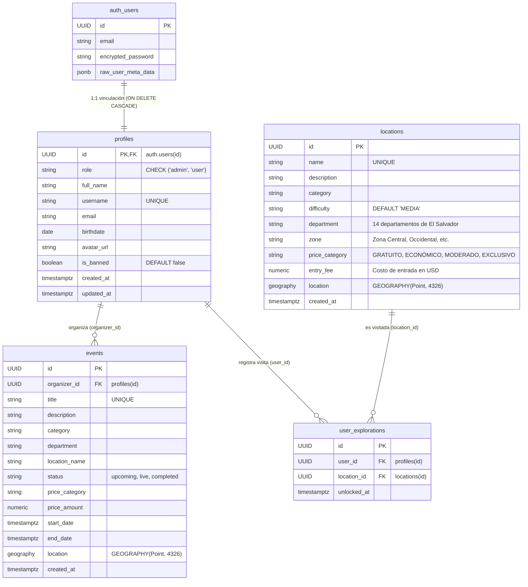

# 🌋 GeoTurismo — Backend API & Esquema de Base de Datos

Microservicio REST de alto rendimiento construido con **Node.js 22 LTS**, **TypeScript** y **Fastify v5**, complementado con **Supabase** (PostgreSQL 15 + PostGIS). Provee endpoints geoespaciales, autenticación con validación de roles (RBAC) y procedimientos almacenados para la plataforma **GeoTurismo**.

---

## 🛠️ Stack Tecnológico del Backend

- **Runtime & Motor:** Node.js `>= 22.0.0` (ESM nativo).
- **Framework Web:** [Fastify v5](https://fastify.dev/) (Rendimiento extremo con overhead mínimo).
- **Lenguaje:** TypeScript 5 en modo estricto (`NodeNext` module resolution).
- **Validación de Datos:** [Zod](https://zod.dev/) para parseo estricto de variables de entorno y query parameters.
- **Seguridad HTTP:** `@fastify/helmet` (políticas de cabeceras seguras) y `@fastify/cors` (soporte CORS flexible).
- **Conectividad BaaS:** `@supabase/supabase-js` con patrón de doble cliente:
  - `supabaseClient` (Anon): Validación de tokens de usuario `Bearer JWT` mediante `auth.getUser()`.
  - `supabaseAdmin` (Service Role): Ejecución de funciones RPC PostGIS y administración de base de datos sin restricción RLS.
- **Base de Datos:** PostgreSQL 15 con extensión geoespacial `postgis` en Supabase Cloud.
- **Infraestructura:** Preparado para despliegue automatizado en [Render](https://render.com/) vía `render.yaml` y Dockerfile multi-stage.

---

## 📁 Estructura del Módulo Backend

```text
backend/
├── src/
│   ├── config/
│   │   ├── env.ts                  # Validación de variables de entorno con Zod
│   │   └── supabase.ts             # Instancias cliente de Supabase (Anon y Admin)
│   ├── db/
│   │   └── schema.sql              # Esquema DDL completo: tablas, triggers, RLS y RPCs
│   ├── modules/
│   │   ├── health/
│   │   │   └── health.routes.ts   # GET /health
│   │   ├── locations/
│   │   │   └── locations.routes.ts# GET /api/locations y GET /api/v1/locations/:id
│   │   ├── places/
│   │   │   ├── places.schema.ts   # Validación Zod de parámetros de consulta geográfica
│   │   │   └── places.routes.ts   # GET /api/v1/places/nearby (PostGIS ST_DWithin)
│   │   └── profiles/
│   │       └── profiles.routes.ts # GET /api/v1/profiles/me y /:id
│   ├── app.ts                      # Ensamblador de middlewares, rutas y error handlers
│   └── server.ts                   # Punto de entrada y gestión de Graceful Shutdown
├── Dockerfile                      # Imagen multi-stage en node:22-alpine
├── render.yaml                     # Manifiesto de infraestructura como código (Render)
├── package.json                    # Dependencias y scripts
├── tsconfig.json                   # Configuración del compilador TypeScript
├── .env.example                    # Plantilla de variables de entorno
└── README.md                       # Esta documentación
```

---

## 📡 Matriz de Endpoints HTTP

| Método | Ruta | Autenticación | Descripción | Respuesta Exitosa |
| :--- | :--- | :--- | :--- | :--- |
| `GET` | `/health` | Pública | Verificación de estado y uptime del microservicio. | `200 OK` con JSON `{ status: "ok", service: "geoturismo-backend", uptime: ... }` |
| `GET` | `/api/locations` | Pública | Listado completo de atalayas y destinos turísticos. Invoca RPC `get_all_locations()`. | `200 OK` con `{ success: true, count: N, data: [...] }` |
| `GET` | `/api/v1/locations` | Pública | Alias versionado para consultar todas las atalayas. | `200 OK` con `{ success: true, count: N, data: [...] }` |
| `GET` | `/api/v1/locations/:id` | Pública | Detalle de una atalaya específica por su UUID. | `200 OK` con el registro o `404 Not Found` |
| `GET` | `/api/v1/places/nearby` | Pública | Búsqueda radial de destinos cercanos usando PostGIS `ST_DWithin`. Valida `lat`, `lng` y `radius` con Zod. | `200 OK` con `{ success: true, meta: { center, radiusInMeters, count }, data: [...] }` |
| `GET` | `/api/v1/profiles/me` | Bearer JWT | Retorna el perfil y rol RBAC (`admin` o `user`) del usuario autenticado. | `200 OK` con datos del perfil o `401 Unauthorized` |
| `GET` | `/api/v1/profiles/:id` | Pública | Perfil público de un usuario por su UUID. | `200 OK` con `{ id, role, full_name, username, avatar_url }` |

---

## 🔍 Detalle de Endpoints Clave

### 1. Búsqueda Radial de Lugares Cercanos (`GET /api/v1/places/nearby`)
- **Query Parameters (validados con Zod en `places.schema.ts`):**
  - `lat` *(number, requerido)*: Latitud entre `-90` y `90`.
  - `lng` *(number, requerido)*: Longitud entre `-180` y `180`.
  - `radius` *(number, opcional, por defecto: `5000`)*: Radio en metros (máximo: `50000` m / 50 km).
- **Ejemplo de Petición:**
  ```http
  GET /api/v1/places/nearby?lat=13.6929&lng=-89.2182&radius=15000 HTTP/1.1
  Host: localhost:3000
  ```
- **Ejemplo de Respuesta:**
  ```json
  {
    "success": true,
    "meta": {
      "center": { "lat": 13.6929, "lng": -89.2182 },
      "radiusInMeters": 15000,
      "count": 2
    },
    "data": [
      {
        "id": "18f2f2bc-...",
        "name": "Centro Histórico de San Salvador",
        "category": "NÚCLEO URBANO",
        "difficulty": "BAJA",
        "department": "San Salvador",
        "zone": "Zona Central",
        "price_category": "GRATUITO",
        "entry_fee": 0.00,
        "lat": 13.6983,
        "lng": -89.1914,
        "distance_meters": 2984.15
      }
    ]
  }
  ```

### 2. Perfil Autenticado (`GET /api/v1/profiles/me`)
- **Encabezados:** `Authorization: Bearer <SUPABASE_USER_ACCESS_TOKEN>`
- **Ejemplo de Respuesta:**
  ```json
  {
    "success": true,
    "data": {
      "id": "a0eebc99-9c0b-4ef8-bb6d-6bb9bd380a11",
      "role": "admin",
      "full_name": "Administrador del Sistema",
      "username": "admin_vertice",
      "email": "admin@vertice.app",
      "birthdate": null,
      "avatar_url": null,
      "created_at": "2026-09-24T00:00:00Z",
      "updated_at": "2026-09-24T00:00:00Z"
    }
  }
  ```

---

## 🗄️ Esquema de Base de Datos (`schema.sql`)

El script [`schema.sql`](file:///backend/src/db/schema.sql) implementa un modelo de datos robusto con extensiones geoespaciales, seguridad a nivel de filas y sincronización reactiva de identidades.

### Diagrama Entidad-Relación Conceptual



---

## 🌐 Funciones Almacenadas PostGIS (RPC)

Para evitar la transferencia de geometrías binarias complejas y acelerar las consultas espaciales en clientes móviles y web, `schema.sql` expone 3 funciones con `SECURITY DEFINER`:

### 1. `get_all_locations()`
- **Propósito:** Retorna todas las atalayas con sus metadatos territoriales y extrae directamente la latitud y longitud numéricas mediante `ST_Y(l.location::geometry)` y `ST_X(l.location::geometry)`.
- **Filtro de Seguridad:** Valida que el usuario invocante no esté suspendido (`is_banned() = false`).
- **Uso en Backend:** Invocado en `locations.routes.ts` mediante `supabaseAdmin.rpc("get_all_locations")`.

### 2. `nearby_locations(user_lat, user_lng, radius_meters)`
- **Parámetros:**
  - `user_lat DOUBLE PRECISION`: Latitud de referencia.
  - `user_lng DOUBLE PRECISION`: Longitud de referencia.
  - `radius_meters DOUBLE PRECISION DEFAULT 50000`: Radio de corte en metros.
- **Lógica Espacial:**
  - Utiliza `ST_DWithin(l.location, ST_SetSRID(ST_MakePoint(user_lng, user_lat), 4326)::geography, radius_meters)` para filtrado por índice espacial GIST.
  - Calcula la distancia métrica exacta en el elipsoide WGS84 con `ST_Distance(...)`.
  - Ordena los resultados de menor a mayor distancia (`ORDER BY distance_meters ASC`).

### 3. `get_all_events()`
- **Propósito:** Retorna la agenda cronológica de eventos en El Salvador (`start_date ASC`), uniendo la información del perfil del organizador (`organizer_name` y `organizer_avatar`) y las coordenadas desempaquetadas.

---

## ⚡ Triggers de Sincronización Automática

1. **`handle_new_user()` (`AFTER INSERT ON auth.users`):**
   - Se activa cuando un usuario completa el registro en Supabase GoTrue.
   - Extrae automáticamente `full_name`, `username`, `birthdate`, `avatar_url` y `role` desde `raw_user_meta_data`.
   - Si el correo es el reservado `admin@vertice.app`, se le concede automáticamente el rol `'admin'`. En cualquier otro caso, se asegura el rol `'user'`.
   - Inserta o actualiza el registro correspondiente en `public.profiles`.

2. **`handle_user_email_sync()` (`AFTER UPDATE ON auth.users`):**
   - Monitorea si el email fue actualizado en el módulo de autenticación y replica el nuevo valor en `public.profiles.email`.

3. **`handle_updated_at()` (`BEFORE UPDATE ON public.profiles`):**
   - Actualiza automáticamente la columna `updated_at` con `timezone('utc'::text, now())`.

---

## 🛡️ Políticas de Seguridad Row Level Security (RLS)

- **`profiles`:**
  - Lectura pública para usuarios no suspendidos (`NOT is_banned()`).
  - Inserción y actualización restringida al propio usuario (`auth.uid() = id`) o administradores (`is_admin()`).
  - Eliminación exclusiva de administradores.
- **`locations`:**
  - Lectura pública para usuarios no suspendidos.
  - Inserción, actualización y eliminación exclusivas para usuarios con rol `admin`.
- **`events`:**
  - Lectura pública.
  - Inserción permitida a cualquier usuario autenticado no suspendido (asociando su `organizer_id`).
  - Modificación y eliminación restringida al creador del evento (`organizer_id = auth.uid()`) o administradores.
- **`user_explorations`:**
  - Lectura y escritura limitada al usuario propietario del registro (`auth.uid() = user_id`) o administradores.
- **Bucket `storage.objects` (`avatars`):**
  - Lectura pública de avatares.
  - Subida, edición y borrado restringidos a la carpeta del propio usuario (`auth.uid()::text = split_part(name, '/', 1)`) o administradores.

---

## 🚀 Despliegue y Ejecución Local

### 1. Variables de Entorno
Crea el archivo `.env` en la raíz de `backend/`:
```env
PORT=3000
HOST=0.0.0.0
NODE_ENV=development
SUPABASE_URL=https://tu-proyecto.supabase.co
SUPABASE_ANON_KEY=tu-anon-key-publica
SUPABASE_SERVICE_ROLE_KEY=tu-service-role-key-secreta
```

### 2. Comandos de Terminal
```bash
# Instalar paquetes
npm install

# Modo desarrollo con recarga en caliente (tsx watch)
npm run dev

# Compilar TypeScript a JavaScript estándar (/dist)
npm run build

# Ejecutar versión compilada en producción
npm start

# Limpiar artefactos compilados
npm run clean
```

### 3. Despliegue con Docker
```bash
# Construir imagen multi-etapa
docker build -t geoturismo-backend .

# Ejecutar contenedor
docker run -d -p 3000:3000 --env-file .env --name geoturismo-api geoturismo-backend
```
