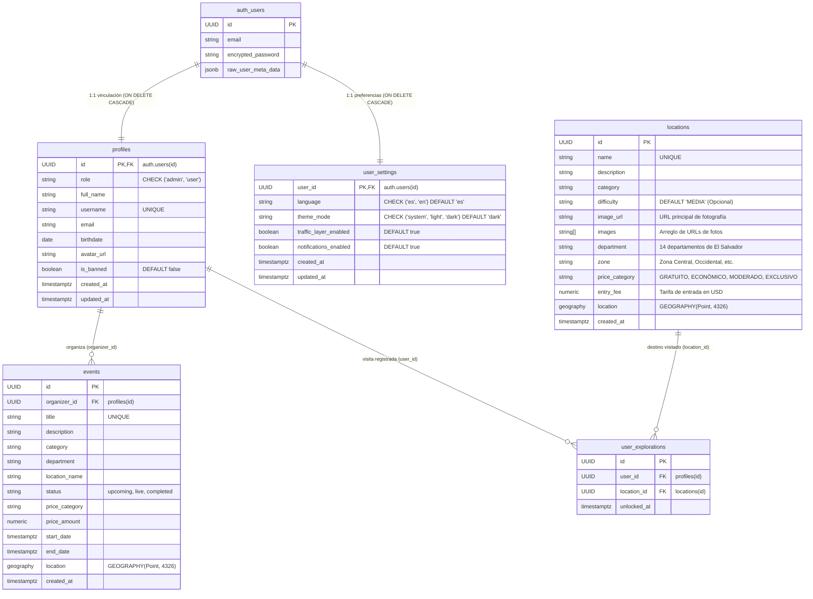

# 🌋 Next Trip — Backend API & Esquema de Base de Datos (v1.5.0 beta)

> **Next Trip Backend API v1.5.0 beta**  
> Desarrollado por **The Green Team**  
> Fecha de edición: **Septiembre 2026**

Microservicio REST de alto rendimiento construido con **Node.js 22 LTS**, **TypeScript 5** y **Fastify v5**, complementado con **Supabase** (PostgreSQL 15 + PostGIS). Provee endpoints geoespaciales para El Salvador, autenticación con validación de roles (RBAC) y procedimientos almacenados para la plataforma **Next Trip**.

---

## 🛠️ Stack Tecnológico del Backend

- **Runtime & Motor:** Node.js `>= 22.0.0` (ESM nativo).
- **Framework Web:** [Fastify v5](https://fastify.dev/) (Rendimiento extremo con overhead mínimo).
- **Lenguaje:** TypeScript 5 en modo estricto (`NodeNext` module resolution).
- **Validación de Datos:** [Zod](https://zod.dev/) para parseo estricto de variables de entorno y query parameters.
- **Seguridad HTTP:** `@fastify/helmet` (políticas de cabeceras seguras) y `@fastify/cors` (soporte CORS flexible).
- **Conectividad BaaS:** `@supabase/supabase-js` con patrón de doble cliente:
  - `supabaseClient` (Anon): Validación de tokens de usuario `Bearer JWT` mediante `auth.getUser()`.
  - `supabaseAdmin` (Service Role): Ejecución de funciones RPC PostGIS y administración de base de datos sin restricción RLS.
- **Base de Datos:** PostgreSQL 15 con extensión geoespacial `postgis` en Supabase Cloud.
- **Infraestructura:** Despliegue en [Render](https://render.com/) vía `render.yaml` y Dockerfile multi-stage.

---

## 📁 Estructura del Módulo Backend

```text
backend/
├── src/
│   ├── config/
│   │   ├── env.ts                  # Validación de variables de entorno con Zod
│   │   └── supabase.ts             # Instancias cliente de Supabase (Anon y Admin)
│   ├── db/
│   │   └── schema.sql              # Esquema DDL: tablas, triggers, RLS y RPCs
│   ├── modules/
│   │   ├── health/
│   │   │   └── health.routes.ts   # GET /health
│   │   ├── locations/
│   │   │   └── locations.routes.ts# GET /api/locations y GET /api/v1/locations/:id
│   │   ├── places/
│   │   │   ├── places.schema.ts   # Validación Zod de parámetros de consulta geográfica
│   │   │   └── places.routes.ts   # GET /api/v1/places/nearby (PostGIS ST_DWithin)
│   │   └── profiles/
│   │       └── profiles.routes.ts # GET /api/v1/profiles/me y /:id
│   ├── app.ts                      # Ensamblador de middlewares, rutas y error handlers
│   └── server.ts                   # Punto de entrada y gestión de Graceful Shutdown
├── Dockerfile                      # Imagen multi-stage en node:22-alpine
├── render.yaml                     # Manifiesto de infraestructura como código (Render)
├── package.json                    # Dependencias y scripts
├── tsconfig.json                   # Configuración del compilador TypeScript
├── .env.example                    # Plantilla de variables de entorno
└── README.md                       # Esta documentación técnica
```

---

## 📡 Matriz de Endpoints HTTP

| Método | Ruta | Autenticación | Descripción | Respuesta Exitosa |
| :--- | :--- | :--- | :--- | :--- |
| `GET` | `/health` | Pública | Verificación de estado y uptime del microservicio. | `200 OK` con JSON `{ status: "ok", service: "nexttrip-backend", uptime: ... }` |
| `GET` | `/api/locations` | Pública | Listado completo de destinos y lugares turísticos. Invoca RPC `get_all_locations()`. | `200 OK` con `{ success: true, count: N, data: [...] }` |
| `GET` | `/api/v1/locations` | Pública | Alias versionado para consultar todos los destinos turísticos. | `200 OK` con `{ success: true, count: N, data: [...] }` |
| `GET` | `/api/v1/locations/:id` | Pública | Detalle de un destino turístico específico por su UUID. | `200 OK` con el registro o `404 Not Found` |
| `GET` | `/api/v1/places/nearby` | Pública | Búsqueda radial de destinos cercanos usando PostGIS `ST_DWithin`. Valida `lat`, `lng` y `radius` con Zod. | `200 OK` con `{ success: true, meta: { center, radiusInMeters, count }, data: [...] }` |
| `GET` | `/api/v1/profiles/me` | Bearer JWT | Retorna el perfil y rol RBAC (`admin` o `user`) del usuario autenticado. | `200 OK` con datos del perfil o `401 Unauthorized` |
| `GET` | `/api/v1/profiles/:id` | Pública | Perfil público de un usuario por su UUID. | `200 OK` con `{ id, role, full_name, username, avatar_url }` |

---

## 🔍 Detalle de Endpoints Clave

### 1. Búsqueda Radial de Lugares Cercanos (`GET /api/v1/places/nearby`)
- **Query Parameters (validados con Zod en `places.schema.ts`):**
  - `lat` *(number, requerido)*: Latitud entre `-90` y `90`.
  - `lng` *(number, requerido)*: Longitud entre `-180` y `180`.
  - `radius` *(number, opcional, por defecto: `5000`)*: Radio en metros (máximo: `50000` m / 50 km).
- **Ejemplo de Petición:**
  ```http
  GET /api/v1/places/nearby?lat=13.6929&lng=-89.2182&radius=15000 HTTP/1.1
  Host: localhost:3000
  ```
- **Ejemplo de Respuesta:**
  ```json
  {
    "success": true,
    "meta": {
      "center": { "lat": 13.6929, "lng": -89.2182 },
      "radiusInMeters": 15000,
      "count": 2
    },
    "data": [
      {
        "id": "18f2f2bc-...",
        "name": "Centro Histórico de San Salvador",
        "category": "CENTRO HISTÓRICO / CULTURAL",
        "department": "San Salvador",
        "zone": "Zona Central",
        "price_category": "GRATUITO",
        "entry_fee": 0.00,
        "image_url": "https://.../centro_historico.jpg",
        "lat": 13.6983,
        "lng": -89.1914,
        "distance_meters": 2984.15
      }
    ]
  }
  ```

### 2. Perfil Autenticado (`GET /api/v1/profiles/me`)
- **Encabezados:** `Authorization: Bearer <SUPABASE_USER_ACCESS_TOKEN>`
- **Ejemplo de Respuesta:**
  ```json
  {
    "success": true,
    "data": {
      "id": "a0eebc99-9c0b-4ef8-bb6d-6bb9bd380a11",
      "role": "admin",
      "full_name": "Administrador del Sistema",
      "username": "admin_vertice",
      "email": "admin@vertice.app",
      "birthdate": null,
      "avatar_url": null,
      "created_at": "2026-09-24T00:00:00Z",
      "updated_at": "2026-09-24T00:00:00Z"
    }
  }
  ```

---

## 🗄️ Esquema de Base de Datos (`schema.sql`)

El script [`schema.sql`](file:///backend/src/db/schema.sql) implementa un modelo relacional y espacial optimizado:

### Diagrama Entidad-Relación Conceptual


```mermaid
erDiagram
    auth_users ||--|| profiles : "1:1 vinculación (ON DELETE CASCADE)"
    auth_users ||--|| user_settings : "1:1 preferencias (ON DELETE CASCADE)"
    profiles ||--o{ events : "organiza (organizer_id)"
    profiles ||--o{ user_explorations : "visita registrada (user_id)"
    locations ||--o{ user_explorations : "destino visitado (location_id)"

    auth_users {
        UUID id PK
        string email
        string encrypted_password
        jsonb raw_user_meta_data
    }

    profiles {
        UUID id PK,FK "auth.users(id)"
        string role "CHECK ('admin', 'user')"
        string full_name
        string username "UNIQUE"
        string email
        date birthdate
        string avatar_url
        boolean is_banned "DEFAULT false"
        timestamptz created_at
        timestamptz updated_at
    }

    user_settings {
        UUID user_id PK,FK "auth.users(id)"
        string language "CHECK ('es', 'en') DEFAULT 'es'"
        string theme_mode "CHECK ('system', 'light', 'dark') DEFAULT 'dark'"
        boolean traffic_layer_enabled "DEFAULT true"
        boolean notifications_enabled "DEFAULT true"
        timestamptz created_at
        timestamptz updated_at
    }

    locations {
        UUID id PK
        string name "UNIQUE"
        string description
        string category
        string difficulty "DEFAULT 'MEDIA' (Opcional)"
        string image_url "URL principal de fotografía"
        string[] images "Arreglo de URLs de fotos"
        string department "14 departamentos de El Salvador"
        string zone "Zona Central, Occidental, etc."
        string price_category "GRATUITO, ECONÓMICO, MODERADO, EXCLUSIVO"
        numeric entry_fee "Tarifa de entrada en USD"
        geography location "GEOGRAPHY(Point, 4326)"
        timestamptz created_at
    }

    events {
        UUID id PK
        UUID organizer_id FK "profiles(id)"
        string title "UNIQUE"
        string description
        string category
        string department
        string location_name
        string status "upcoming, live, completed"
        string price_category
        numeric price_amount
        timestamptz start_date
        timestamptz end_date
        geography location "GEOGRAPHY(Point, 4326)"
        timestamptz created_at
    }

    user_explorations {
        UUID id PK
        UUID user_id FK "profiles(id)"
        UUID location_id FK "locations(id)"
        timestamptz unlocked_at
    }
```

### Nueva Tabla: `public.user_settings`
Diseñada para almacenar de forma centralizada las preferencias de la aplicación:
- **`user_id`**: Clave primaria con referencia en cascada a `auth.users(id)`.
- **`language`**: Código de idioma activo (`es` para Español o `en` para Inglés).
- **`theme_mode`**: Modo visual seleccionado (`system`, `light`, `dark`).
- **`traffic_layer_enabled`**: Indicador booleano para la visibilidad de la capa de tráfico vial.
- **`notifications_enabled`**: Preferencia de alertas y avisos del sistema.
- **Políticas RLS:** Acceso y actualización restringidos al propio usuario (`auth.uid() = user_id`).

### Flexibilización de `public.locations`
- Soporte para URLs de fotografías mediante `image_url TEXT` e `images TEXT[]`.
- Desvinculación de restricciones de dificultad (`difficulty` ahora es opcional con valor por defecto neutro `'MEDIA'`), eliminando su presencia en las interfaces de usuario.

---

## 🌐 Funciones Almacenadas PostGIS (RPC)

Para optimizar el ancho de banda y agilizar las consultas espaciales en clientes móviles, `schema.sql` expone funciones con `SECURITY DEFINER`:

### 1. `get_all_locations()`
- Retorna el catálogo completo de destinos turísticos extrayendo latitud y longitud numéricas con `ST_Y(l.location::geometry)` y `ST_X(l.location::geometry)`.
- Valida que el usuario no se encuentre suspendido (`is_banned() = false`).

### 2. `nearby_locations(user_lat, user_lng, radius_meters)`
- Realiza el filtrado espacial mediante el operador `ST_DWithin` sobre índice `GIST`.
- Calcula la distancia en metros sobre el elipsoide WGS84 y retorna los destinos ordenados por proximidad.

### 3. `get_all_events()`
- Retorna la cartelera de eventos turísticos y culturales de El Salvador ordenada cronológicamente (`start_date ASC`), vinculando los datos del organizador.

---

## ⚡ Triggers Automatizados

1. **`handle_new_user()` (`AFTER INSERT ON auth.users`):**
   - Extrae metadatos del usuario y crea automáticamente su perfil en `public.profiles`.
   - Inserta su fila correspondiente en `public.user_settings` con los valores por defecto (`language: 'es'`, `theme_mode: 'dark'`, `traffic_layer_enabled: true`, `notifications_enabled: true`) usando `ON CONFLICT (user_id) DO NOTHING`.
2. **`handle_user_email_sync()` (`AFTER UPDATE ON auth.users`):**
   - Mantiene sincronizado el correo electrónico en `public.profiles`.
3. **`handle_updated_at()` (`BEFORE UPDATE`):**
   - Actualiza la marca de tiempo `updated_at` en `profiles` y `user_settings`.

---

## 🛡️ Políticas de Seguridad Row Level Security (RLS)

- **`user_settings`:** Lectura, inserción y actualización exclusivas del propio usuario (`auth.uid() = user_id`).
- **`profiles`:** Lectura pública para usuarios activos; actualización restringida al propio usuario o administradores.
- **`locations`:** Lectura pública; inserción, edición y borrado reservados a usuarios con rol `admin`.
- **`events`:** Lectura pública; inserción permitida a usuarios autenticados; edición restringida al organizador o administradores.
- **`storage.objects` (`avatars`):** Lectura pública; escritura restringida a la carpeta del propio usuario (`auth.uid()`).

---

## 🚀 Despliegue y Ejecución Local

### 1. Variables de Entorno
Crea el archivo `.env` en la raíz de `backend/`:
```env
PORT=3000
HOST=0.0.0.0
NODE_ENV=development
SUPABASE_URL=https://tu-proyecto.supabase.co
SUPABASE_ANON_KEY=tu-anon-key-publica
SUPABASE_SERVICE_ROLE_KEY=tu-service-role-key-secreta
```

### 2. Comandos de Terminal
```bash
npm install        # Instalar dependencias
npm run dev        # Modo desarrollo con recarga automática
npm run build      # Compilar TypeScript a /dist
npm start          # Ejecutar en producción
```

### 3. Despliegue con Docker
```bash
docker build -t nexttrip-backend .
docker run -d -p 3000:3000 --env-file .env --name nexttrip-api nexttrip-backend
```
